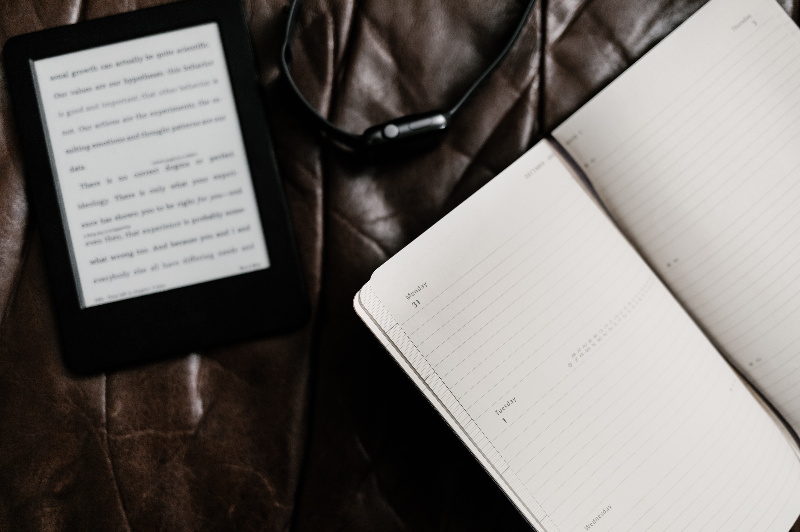

#### 2019年Flag

> 2019年度计划，从现在开始过好他。

##### 1. 身体管理
- 体重目标126斤
- 体检
- 素食为主
- 尽量不饮酒
- 每周健身3次，跑步25公里
- 12点前睡觉

##### 2. 习惯养成
- 保持健身
- 早餐每天都吃
- 早起，周一到周五7点起床，周末9点之前起床
- 控制饭量，晚餐少食
- 读或者听非技术书每月一本
- 练习吉他

##### 3. 技术
- 读技术书籍25本
- 博客55篇，写系列博客
- 学习区块链技术
- 参加技术沙龙每月至少2次
- spring技术栈吃透，包括源码的学习

##### 4. 财务管理
- 交易系统建立
- 股票相关知识学习
- 一年时间《日本蜡烛图技术》学习透彻，看完

##### 5. 工作
- 认真完成工作任务
- 优化项目

##### 6. 生活
- 多和家人联系
- 电话簿至少每季度整理一次
- 外地朋友，扩大沟通频率